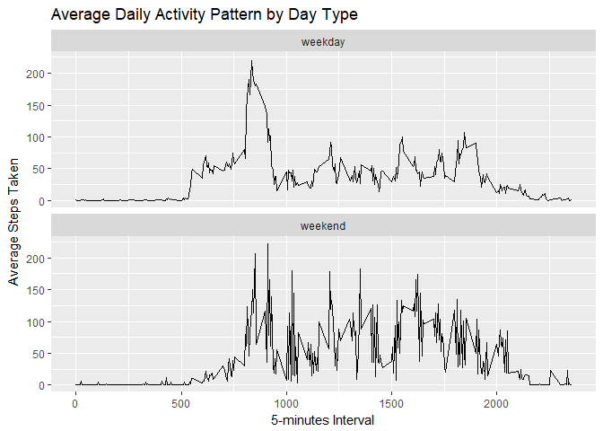

## 1.0 Introduction
This assignment makes use of data from a personal activity monitoring device. 
This device collects data at 5 minute intervals through out the day. The data 
consists of two months of data from an anonymous individual collected during 
the months of October and November, 2012 and include the number of steps taken 
in 5 minute intervals each day.

The data for this assignment can be downloaded here: 
https://d396qusza40orc.cloudfront.net/repdata%2Fdata%2Factivity.zip

##2.0 Loading and Preprocessing the Data
###2.1 Global options and load package
Global option for echo is set to TRUE to show code chunks in the report. 
For this analysis, we are using the dplyr and ggplot2 packages.

```r
knitr::opts_chunk$set(echo = TRUE, eval = TRUE)
library(dplyr)
library(ggplot2)
```

###2.2 Get the Dataset
The dataset is available in the repository in zip format. Data is then unzipped 
and saved in the same directory. Then load the dataset onto R.

```r
if(!file.exists("activity.csv")){
zipF <- "activity.zip"
unzip(zipF)
rm(list = ls())}
df <- read.csv("activity.csv")
```

###2.3 Preprocess Data 
Convert the date variable to class "Date" and remove all rows with NAs for 
later analysis. 

```r
df$date <- as.Date(df$date)
df_rm_na <- df[complete.cases(df),]
df_sum <- df_rm_na %>% group_by(date) %>% summarise(steps = sum(steps))
```

##3.0 Steps Taken Daily
###3.1 Plot Histogram
First, calculate total number of steps taken each day (group data by date).
Note that data without NAs is used for this analysis.

```r
df_sum <- df_rm_na %>% group_by(date) %>% summarise(steps = sum(steps))
```
Next, use the total number of steps taken each day to plot the histogram.

```r
hist(x = df_sum$steps, 
         main = "Total Number of Steps Taken Daily",
         xlab = "Steps Taken Daily", ylab = "Frequency",
         col = rgb(0.1,0.1,0.1,0.5), breaks = 20, las = 1)
box()
```

<!-- -->

###3.2 Calculate Mean and Median
Mean and median of total steps taken each day are calculated below:

```r
mean(df_sum$steps)
```

```
## [1] 10766.19
```

```r
median(df_sum$steps)
```

```
## [1] 10765
```

##4.0 Average Daily Activity Pattern
###4.1 Average Steps per Interval
Calculate average steps at every interval across all dates.

```r
df_interval <- df_rm_na %>% group_by(interval) %>% 
        summarise(steps = mean(steps)) %>% as.data.frame
```

###4.2 Create Time Series Plot
Make a time series plot of the 5-minute interval (x-axis) and the average number 
of steps taken across all days (y-axis).

```r
ggplot(df_interval, aes(df_interval$interval, df_interval$steps)) + geom_line() +
        xlab("5-minutes Interval") + ylab("Average Steps Taken") + 
        ggtitle("Average Daily Activity Pattern")
```

<!-- -->

###4.3 Interval with maximum number of steps

```r
df_interval[df_interval$steps==max(df_interval$steps),1]
```

```
## [1] 835
```

##5.0 Handling Missing Values (NAs)
###5.1 Calculate no of rows with missing values(NA)

```r
sum_na <- sum(is.na(df))
```
No. of rows with missing values is 2304.

###5.2 Replace NA with number of average steps across all days
All missing values in steps column are replaced by number of average steps 
for the same interval. 
Firstly, dataset containing only rows with NAs is extracted and merged with 
dataset with average steps across all days (df_interval) by matching 
the interval column.
The resulting dataset is then joined with dataset without NAs (df_rm_na) to 
create a complete dataset.

```r
df_na <- df[is.na(df$steps),]
dft <- merge(df_na, df_interval, by.x = "interval", by.y = "interval")
colnames(dft)[4] <- c("steps")
dft$steps.x = dft$steps
dft <- dft[c("steps", "date", "interval")]
df_new <- rbind(dft,df_rm_na)
df_new <- arrange(df_new, date, interval)
```

###5.3 Calculate Mean and Median Using New Dataset
Mean and median of total steps taken each day using the new dataset are:

```r
df_new_sum <- df_new %>% group_by(date) %>% summarise(steps = sum(steps))
mean(df_new_sum$steps)
```

```
## [1] 10766.19
```

```r
median(df_new_sum$steps)
```

```
## [1] 10766.19
```

###5.4 Plot Histogram to Compare Dataset with NAs Removed with New Dataset 
Create two histogram on the same plot using dataset with NAs removed 
(refer section 3) and the new dataset (refer section 5) to compare the data.

```r
hist(df_sum$steps, main = "Total Number of Steps Taken Daily",
             xlab = "Steps Taken Daily", ylab = "Frequency",
             col=rgb(0.1,0.1,0.1,0.5), breaks = 20, las = 1)
hist(df_new_sum$steps, col=rgb(0.8,0.8,0.8,0.5), breaks = 20, ylim = c(0,20), add=T)
legend("topright", c("NA-removed dataser", "New dataset"), fill=c(rgb(0.1,0.1,0.1,0.5), rgb(0.8,0.8,0.8,0.5)))
box()
```

<!-- -->

##6.0 Activity Pattern during "Weekdays" and "Weekends"
###6.1 Add "day type" Variable" to New Dataset
A "day" variable with value "weekday" or "weekend" is added to the new dataset.

```r
df_day <- df_new %>% mutate(day = weekdays(df_new$date)) %>% 
        mutate(day = ifelse(day==c("Saturday", "Sunday"), "weekend", "weekday"))
```

###6.2 Calculate Average Steps for Every Interval during Weekdays and Weekends
Dataset is grouped into day type and interval to calculate the average steps.

```r
df_interval_day <- df_day %>% group_by(day, interval) %>% 
        summarise(steps = mean(steps)) %>% as.data.frame
```

###6.3 Create Time Series Plot for Average Steps Taken on Weekends and Weekdays

```r
timeplot2 <- ggplot(df_interval_day, 
                    aes(df_interval_day$interval, df_interval_day$steps)) + 
        geom_line() + xlab("5-minutes Interval") + ylab("Average Steps Taken") + 
        ggtitle("Average Daily Activity Pattern by Day Type")

timeplot2 + facet_wrap(~day, ncol = 1)
```

<!-- -->

